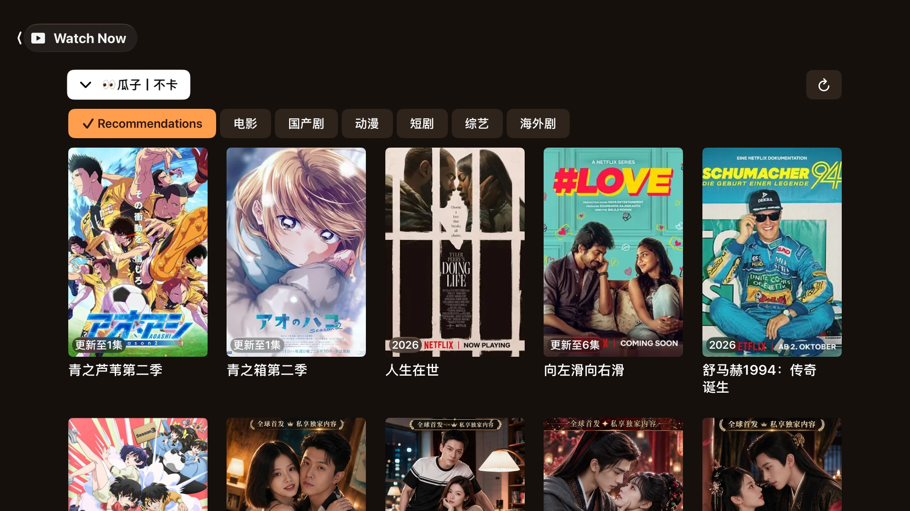
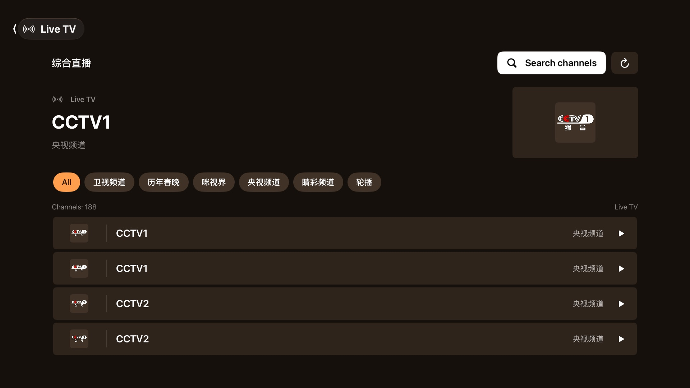
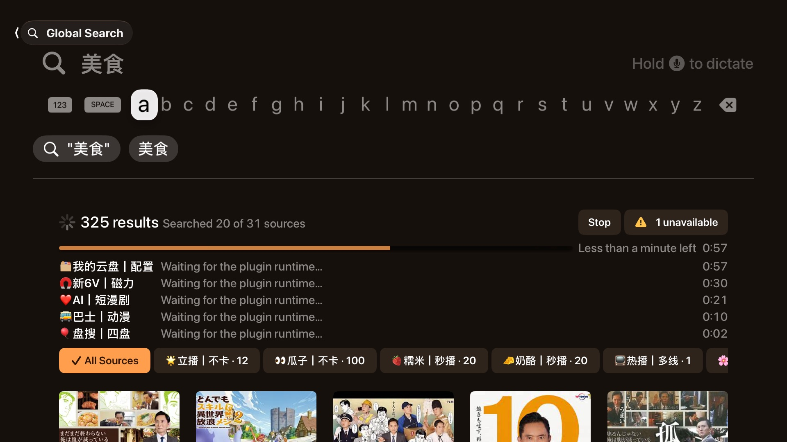

<p align="center">
  <a href="https://yingxia.getmegaportal.com"></a>
</p>

<h1 align="center">Yingxia</h1>

<p align="center">
  <strong>All your sources. One big screen.</strong><br>
  A native TVBox player for Apple TV, iPhone, iPad and Mac.
</p>

<p align="center">
  <a href="https://yingxia.getmegaportal.com"><b>yingxia.getmegaportal.com</b></a>
  &nbsp;·&nbsp;
  <a href="https://download.getmegaportal.com/yingxia/1.0.1/Yingxia-1.0.1-macos-arm64.dmg">Download for Mac</a>
  &nbsp;·&nbsp;
  <a href="Docs/INSTALL.md">Install on iPhone, iPad &amp; Apple TV</a>
  &nbsp;·&nbsp;
  <a href="Docs/DEVELOPMENT.md">Developer guide</a>
</p>

<p align="center">
  
  
  
</p>

<p align="center">
  
</p>

---

Yingxia (映匣) plays your TVBox subscriptions the way an Apple app should: live channels, on-demand catalogs, and one search across every source, all in SwiftUI and AVKit. No web views, no ported Android screens, no account.

👉 **See it in action at [yingxia.getmegaportal.com](https://yingxia.getmegaportal.com)**, including the intro film.

## ✨ Highlights

| | |
| --- | --- |
| 📺 **Live TV, laid out like a guide** | Bring M3U or TXT playlists. Browse by group, search channels, and keep your favorites close. |
| 🔎 **Search everything at once** | One query runs across every source in your subscription, and results appear as they arrive. |
| 🗂️ **Every source gets its own shelf** | Browse each source's categories and pages with nothing but the Siri Remote. |
| 🧩 **Plugins on device** | Runs JSON, JavaScript and JAR sources, plus Python on Mac. Lightweight ports go first, with the original plugin as a fallback. |
| 🛟 **Your subscription, kept safe** | Import any TVBox JSON subscription by URL. A failed refresh never wipes the last working copy. |
| 🎬 **Native playback** | AVPlayer with HLS, clear error screens with Retry, and a separate Picture in Picture player window on Mac. |
| 🔒 **Private by design** | No account and no analytics. Everything stays on your device, and logs redact credentials. |
| 🌏 **Speaks your language** | English, Japanese, and Traditional and Simplified Chinese, following your system setting. |

<p align="center">
  
  
</p>

## 📦 Get it

| Platform | Status |
| --- | --- |
| **Mac** (macOS 26+, Apple silicon) | ✅ [Free download](https://download.getmegaportal.com/yingxia/1.0.1/Yingxia-1.0.1-macos-arm64.dmg), signed and notarized |
| **Apple TV** (tvOS 26+) | 🧪 Preview. [Download the IPA](https://download.getmegaportal.com/yingxia/1.0.1/Yingxia-1.0.1-tvos.ipa) and [sideload it](Docs/INSTALL.md#install-on-apple-tv) |
| **iPhone & iPad** (iOS 26+) | 🧪 Preview. [Download the IPA](https://download.getmegaportal.com/yingxia/1.0.1/Yingxia-1.0.1-ios.ipa) and [sideload it](Docs/INSTALL.md#install-on-iphone-or-ipad) |

The iPhone, iPad and Apple TV apps aren't on the App Store yet. The [install guide](Docs/INSTALL.md) walks you through installing them with your own Apple account (a free one works), keeping them signed, and fixing common problems.

## 🛠️ Build from source

You'll need Xcode, [XcodeGen](https://github.com/yonaskolb/XcodeGen), JDK 19 with Maven, a standalone Node.js binary, and [uv](https://docs.astral.sh/uv/).

```sh
export JAVA_HOME="$(/usr/libexec/java_home -v 19)"
Scripts/build-java-host.sh      # bundled JVM plugin runtime
Scripts/build-script-host.sh    # JavaScript host
Scripts/build-python-host.sh    # Python host
xcodegen generate
open TVBox.xcodeproj            # pick TVBox-macOS, TVBox-iOS or TVBox-tvOS
```

Physical iPhone, iPad and Apple TV builds need your own signing team in Xcode. The [developer guide](Docs/DEVELOPMENT.md) covers command-line builds, tests, source audits, the plugin runtime architecture, and more.

## 🧭 Project map

| Path | What's inside |
| --- | --- |
| `App/` | SwiftUI screens and platform playback |
| `Sources/TVCore/` | Subscriptions, networking, catalogs, localization, runtime boundaries |
| `Runtime/` | JVM, JavaScript and Python plugin hosts |
| `Vendor/` | Vendored DEX interpreter and QuickJS |
| `website/` | The [yingxia.getmegaportal.com](https://yingxia.getmegaportal.com) site |
| `Docs/` | Install guide, developer guide, runtime status, third-party notices |

## 🙏 Acknowledgements

Yingxia stands on the shoulders of [FongMi/TV](https://github.com/FongMi/TV) (reference implementation), [DexLoom](https://github.com/speedyfriend433/DexLoom), [unidbg](https://github.com/zhkl0228/unidbg), [Unicorn](https://github.com/unicorn-engine/unicorn), [dex2jar](https://github.com/ThexXTURBOXx/dex2jar), [QuickJS-ng](https://github.com/quickjs-ng/quickjs) and others. Licenses and details are in [THIRD_PARTY_NOTICES](Docs/THIRD_PARTY_NOTICES.md).

## License

Yingxia's original code is licensed under the [GNU General Public License v3.0](LICENSE) (`GPL-3.0-only`).

Copyright (C) 2026 jo32 and Yingxia contributors.

You may use, modify, and redistribute Yingxia under the terms of this license. When distributing a covered modified version, you must also provide its corresponding source code under GPL-3.0. The software is provided without warranty.

Third-party code and bundled dependencies retain their own licenses and copyright notices; see [Third-Party Notices](Docs/THIRD_PARTY_NOTICES.md).

## ⚖️ Disclaimer

Yingxia is a player. It does not host, provide or endorse any media content, and it shows only what the subscriptions you add provide. You are responsible for using sources you have the right to access. Apple TV, iPhone, iPad and Mac are trademarks of Apple Inc. This project is not affiliated with Apple.

<p align="center"><sub>Made with SwiftUI · <a href="https://yingxia.getmegaportal.com">yingxia.getmegaportal.com</a></sub></p>
